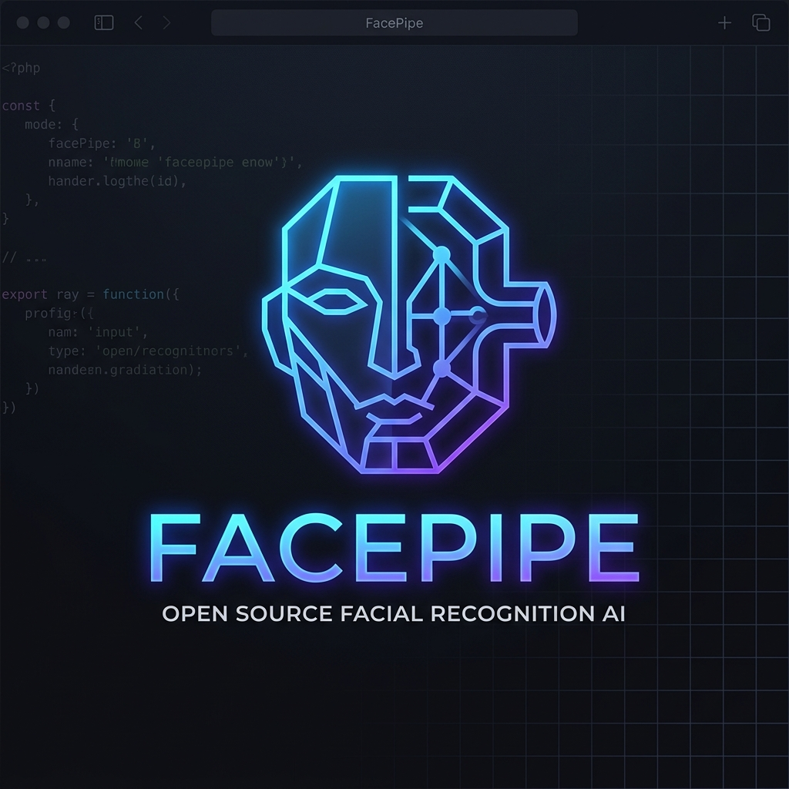

<div align="center">
  
</div>

# FacePipe

**The production-ready face recognition pipeline.**

Detection, quality, liveness, deepfake, recognition, search, tracking, and fusion — all integrated, all configurable, all encrypted.

[](https://opensource.org/licenses/MIT)
[](https://www.python.org/downloads/)
[](https://github.com/labishbardiya/facepipe/actions)

---

## Why FacePipe?

| Feature | FacePipe | InsightFace | DeepFace | face_recognition |
|---------|----------|-------------|----------|------------------|
| Face Detection (SCRFD) | ✅ | ✅ | ✅ | ✅ |
| Quality Gating | ✅ | ❌ | ❌ | ❌ |
| Liveness / Anti-Spoofing | ✅ | ❌ | ❌ | ❌ |
| Deepfake Detection | ✅ | ❌ | ❌ | ❌ |
| Decision Fusion (7 signals) | ✅ | ❌ | ❌ | ❌ |
| Template Aggregation | ✅ | ❌ | ❌ | ❌ |
| Score Normalization (Z/T-norm) | ✅ | ❌ | ❌ | ❌ |
| Multi-Model Ensemble | ✅ | ❌ | ❌ | ❌ |
| Active Learning | ✅ | ❌ | ❌ | ❌ |
| Encrypted Storage (AES-256) | ✅ | ❌ | ❌ | ❌ |
| Scalable Search (FAISS HNSW) | ✅ | ❌ | ❌ | ❌ |
| Video Tracking (ByteTrack) | ✅ | ❌ | ❌ | ❌ |
| REST API | ✅ | ❌ | ✅ | ❌ |

**FacePipe is for engineers building products**, not researchers running notebooks. If you need face recognition that handles spoofing, low quality, deepfakes, and unknown faces out of the box — this is it.

---

## Quick Start

### Install

```bash
pip install facepipe
```

Or from source:

```bash
git clone https://github.com/labishbardiya/facepipe.git
cd facepipe
pip install -e .
```

### Verify Two Faces (5 lines)

```python
import cv2
from facepipe import SCRFDDetector, AdaFaceRecognizer
from facepipe.core.alignment.face_align import align_face
import numpy as np

detector = SCRFDDetector()
recognizer = AdaFaceRecognizer()

def get_embedding(path):
    img = cv2.imread(path)
    face = detector.detect(img)[0]
    aligned = align_face(img, face.landmarks)
    return recognizer.extract(aligned).embedding

similarity = float(np.dot(get_embedding("photo1.jpg"), get_embedding("photo2.jpg")))
print(f"Same person: {similarity > 0.4} (similarity: {similarity:.4f})")
```

### Full Pipeline with Security

```python
from facepipe import RecognitionPipeline

pipeline = RecognitionPipeline()
pipeline.initialize()

# Enroll
result = pipeline.enroll(frames=[img], identity_id="user_001", name="John Doe")

# Recognize (includes quality, liveness, deepfake, fusion)
frame_result = pipeline.process_frame(new_image)
for face in frame_result.faces:
    print(f"{face.decision.identity}: {face.decision.confidence:.3f}")
```

### REST API

```bash
# Start the server
facepipe-server
# or: uvicorn entrypoints.server:app --host 0.0.0.0 --port 8000
```

### Docker

```bash
docker build -t facepipe .
docker run -p 8000:8000 facepipe
```

### Interactive Demo

```bash
pip install facepipe[demo]
python demo/app.py
# Open http://localhost:7860
```

---

## Architecture

```
┌─────────────┐     ┌──────────┐     ┌──────────────┐     ┌──────────┐
│   SCRFD      │────▸│ Quality  │────▸│  Deepfake    │────▸│ Liveness │
│  Detection   │     │  Gate    │     │  Detection   │     │  Check   │
└──────┬───────┘     └──────────┘     └──────────────┘     └────┬─────┘
       │                                                        │
       ▼                                                        ▼
┌─────────────┐     ┌──────────┐     ┌──────────────┐     ┌──────────┐
│  Alignment  │────▸│ Restore  │────▸│  AdaFace /   │────▸│  FAISS   │
│ (5-point)   │     │ (if low  │     │  ArcFace     │     │  HNSW    │
│             │     │  quality) │     │  + TTA       │     │  Search  │
└─────────────┘     └──────────┘     └──────────────┘     └────┬─────┘
                                                               │
       ┌───────────────────────────────────────────────────────┘
       ▼
┌─────────────┐     ┌──────────┐     ┌──────────────┐     ┌──────────┐
│  Open-Set   │────▸│ByteTrack │────▸│  Decision    │────▸│ Active   │
│ Recognition │     │ Tracking │     │  Fusion      │     │ Learning │
│             │     │          │     │ (7 signals)  │     │  Gate    │
└─────────────┘     └──────────┘     └──────────────┘     └──────────┘
```

---

## Benchmark Results

Evaluated on LFW with ArcFace R100 (buffalo_l) + TTA on Apple M4 (CoreML):

| Metric | Value |
|--------|-------|
| **Accuracy** | 98.74% |
| **AUC** | 0.9888 |
| **EER** | 2.37% |
| **TAR@FAR=1e-3** | 97.48% |
| **Failed Pairs** | 43 / 6,000 |

### Run Your Own Benchmarks

```bash
# LFW
facepipe evaluate --pairs pairs.txt --lfw-dir lfw_funneled/ --output results.json

# Failure analysis
facepipe evaluate-failures --pairs pairs.txt --lfw-dir lfw_funneled/ --output failures.json
```

---

## SOTA Techniques

FacePipe implements techniques used by top NIST FRVT performers:

- **Test-Time Augmentation** — Flip averaging + optional brightness/contrast augmentation
- **Quality-Weighted Template Aggregation** — Fuses multi-frame embeddings with adaptive outlier rejection (mean - 1.5σ)
- **Score Normalization** — Z-norm, T-norm, ZT-norm for per-identity calibration at tight operating points
- **Multi-Model Ensemble** — Fuse ArcFace + AdaFace with PCA whitening or quality-gated selection
- **Face Restoration** — CodeFormer-based restoration with re-alignment for surveillance-grade inputs

---

## Configuration

All settings are configurable via environment variables (prefix `FR_`):

```bash
# Recognition
FR_RECOGNITION_TTA_ENABLED=true      # Enable test-time augmentation
FR_RECOGNITION_TTA_EXTENDED=false    # Extended TTA (4 augmentations)

# Score Normalization
FR_NORM_METHOD=z_norm                # z_norm | t_norm | zt_norm | none
FR_NORM_COHORT_SIZE=200

# Template Aggregation
FR_TEMPLATE_STRATEGY=quality_weighted  # quality_weighted | norm_weighted | top_k
FR_TEMPLATE_OUTLIER_SIGMA=1.5

# Security
FR_FUSION_SECURITY_LEVEL=STANDARD     # STANDARD | ELEVATED | MAXIMUM
FR_ENCRYPTION_KEY=<base64-32-byte-key>

# API
FR_API_HOST=0.0.0.0
FR_API_PORT=8000
```

See `.env.example` for the full list.

---

## Contributing

See [CONTRIBUTING.md](CONTRIBUTING.md) for development setup, testing, and PR process.

## License

MIT — see [LICENSE](LICENSE) for details.
