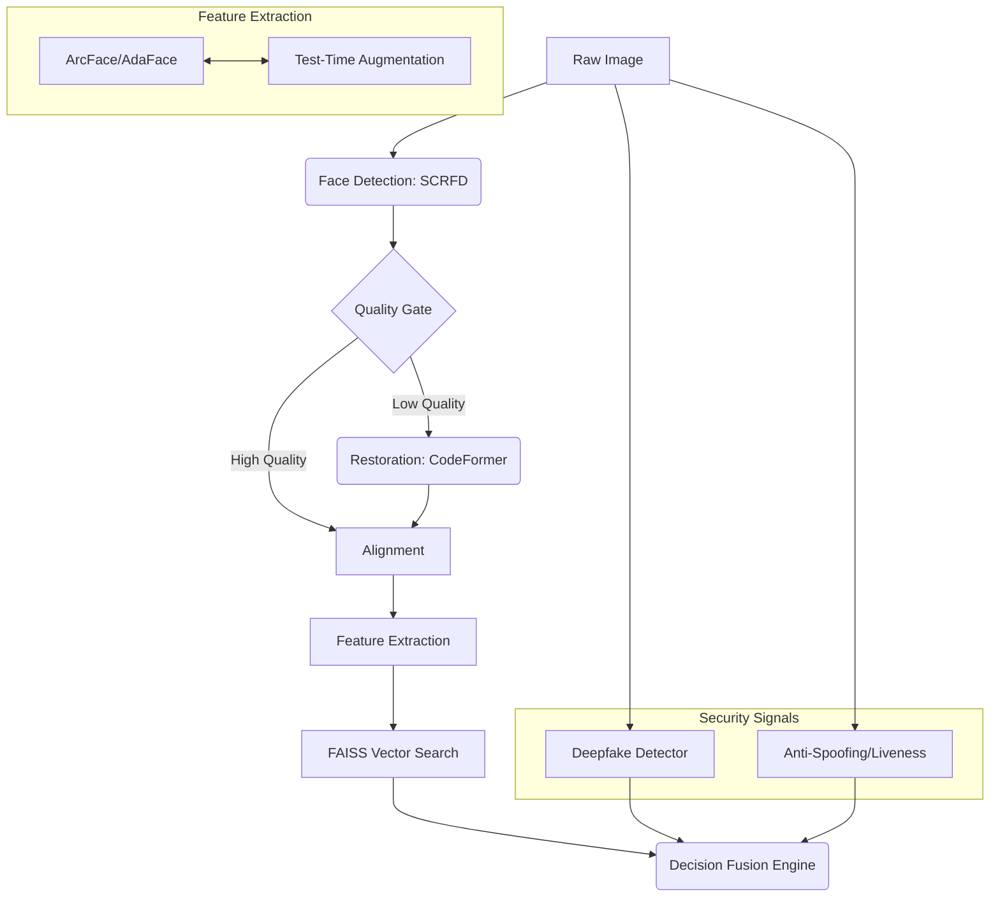

# Architecture

FacePipe uses a multi-stage sequential pipeline to process images. The architecture is designed to fail early (saving compute) and fuse multiple signals at the end (increasing security).

## The Pipeline Flow

### 1. Detection (SCRFD)
We use Sample and Computation Redistributed Feature Pyramid Network (SCRFD) for sub-millisecond face detection. It is highly robust to occlusions and extreme angles.

### 2. Quality Assessment
Before sending a face to the heavy recognition models, we evaluate its quality:
- **Blur Assessment:** Laplacian variance.
- **Pose Estimation:** Yaw, pitch, and roll limits.
- **Size Constraints:** Rejects faces too small for accurate recognition.

### 3. Restoration (CodeFormer)
If a face passes the size constraint but is too blurry, it is routed through the CodeFormer restoration model. This significantly improves recognition accuracy on low-quality surveillance footage.

### 4. Extraction & TTA
Features are extracted using either ArcFace (R100) or AdaFace (IR101).
If Test-Time Augmentation (TTA) is enabled, the image is horizontally flipped, extracted again, and the embeddings are averaged. This provides a measurable boost to accuracy on hard datasets.

### 5. Decision Fusion
The final decision is not just based on cosine similarity. The `DecisionFusionEngine` combines the similarity score, liveness score, deepfake probability, and tracking consistency to output a final, highly secure verdict.
